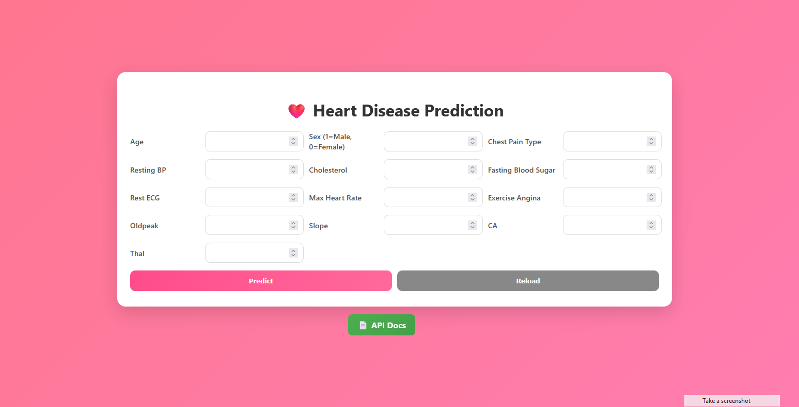
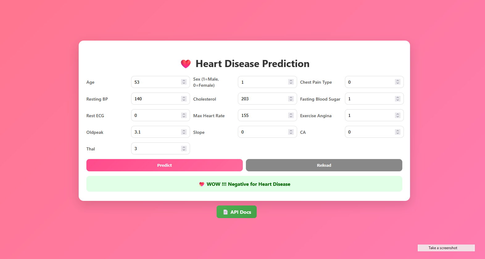
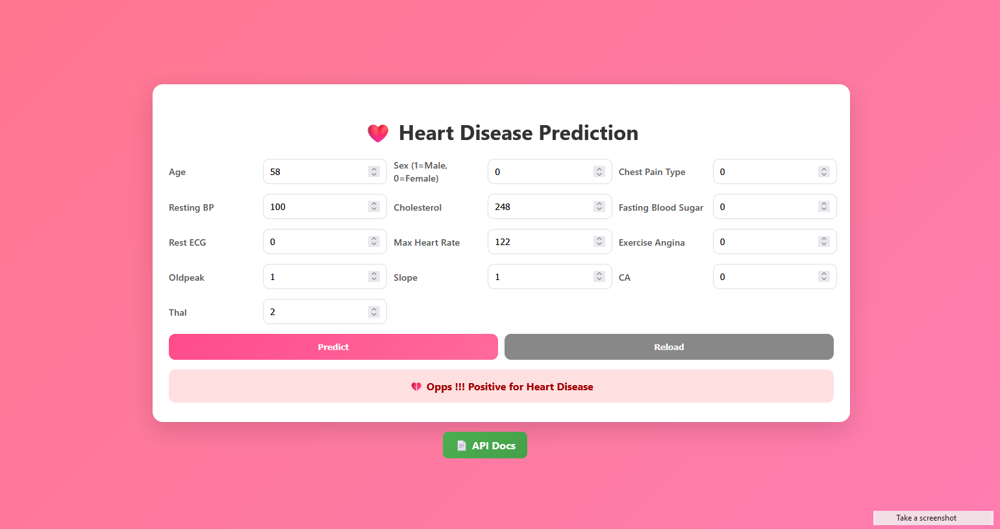

# ❤️ API : Predict Heart Disease
Build a simple **FastAPI** app that serves predictions from a machine learning classifier trained on the Heart Disease Dataset, Dockerize it, and deploy to Render (or any cloud host of your choice). Focus on Docker and deployment, not on achieving high accuracy.

The model is trained using a Random Forest Classifier on the [Kaggle Heart Disease dataset](https://www.kaggle.com/datasets/johnsmith88/heart-disease-dataset).

<br/>

## 🚀 Quick Start

➡ **Live GUI**: [Click here](https://predict-heart-disease-0az6.onrender.com/) <br/>
➡ **Swagger Docs**: [Click here](https://predict-heart-disease-0az6.onrender.com/docs)<br/>
➡ **ReDoc**: [Click here](https://predict-heart-disease-0az6.onrender.com/redoc)

<br/>

## 🌟 Features
- **Machine Learning Model**: Random Forest Classifier trained on heart disease dataset.
- **RESTful API**: Clean, well-documented endpoints using FastAPI.
- **Type Safety**: Full Pydantic schema validation
- **Auto Documentation**: Interactive API docs with Swagger UI
- **Dockerized** for easy deployment.
- **Live on Render** with automatic documentation.

<br/>

## 📂 Project Structure
```bash
PredictHeartDisease/
├── app
│ ├── templates/
│ │ ├── index.html  # User interface
│ │ ├── style.css   # style file
│ ├── main.py       # FastAPI app entry point
│ ├── schemas.py    # Pydantic request/response models
│ ├── model_train_logistic.py # Train model with Logistic Regression
│ └── model_train_random.py   # Train model with Random Forest lassifier
├── model/
│ └── heart_model.joblib    # Trained ML model
├── sample_data/
│ └── heart.csv             # Sample data in csv format
├── requirements.txt        # Python dependencies
├── Dockerfile              # Docker image definition
├── docker-compose.yml      # Optional docker-compose setup
└── README.md               # Project documentation
```

<br/>

## 🛠 Installation & Local Development

### 1. Prerequisites
```bash
- Python 3.8+
- pip (Python package manager)
```

### 2. Clone the repository
```bash
git clone https://github.com/Aronno1920/Predict-Heart-Disease.git
cd PredictHeartDisease
```
### 3. Create and activate a virtual environment
```bash
# On Windows PowerShell
python -m venv venv
Set-ExecutionPolicy -ExecutionPolicy RemoteSigned -Scope CurrentUser
.\venv\Scripts\activate

# On Linux/Mac
python -m venv env
source env/bin/activate
```
### 4. Install dependencies
```bash
pip install -r requirements.txt
```
### 5. Train the model (if not already trained)
```bash
# On Random Forest Classifier
python model_train_random.py

# For Logistic Regression
python model_train_logistic.py
```
### 6. Run the API locally
```bash
uvicorn app.main:app --reload

API will be available at:
API ➡ http://127.0.0.1:8000
Swagger Docs ➡ http://127.0.0.1:8000/docs
ReDoc ➡ http://127.0.0.1:8000/redoc
```

### 7. Run the API locally
```bash
uvicorn app.main:app --reload

API will be available at:
API ➡ http://127.0.0.1:8000
Swagger Docs ➡ http://127.0.0.1:8000/docs
ReDoc ➡ http://127.0.0.1:8000/redoc
```

<br/>

## 📖 API Endpoints
### Main ML API (`app.main`)

| Method | Endpoint | Description |
|--------|----------|-------------|
| GET | `/health` | Health check endpoint |
| GET | `/info` | Model information |
| POST | `/predict` | Predict Iris species |

<br/>

## 🐳 Run with Docker
```bash
docker build -t heart-disease-api .
docker run -p 8000:8000 heart-disease-api
```
## 🌐 Deployed API
```bash
Live Endpoint:
Base URL: https://heart-disease-prediction-joq2.onrender.com
API Endpoints:
Method	Endpoint	Description
GET	/health	Check if the API is running
GET	/info	Get model details and feature list
POST	/predict	Predict heart disease based on input features
📄 Example API Request
POST /predict
```
Request Body:
```bash
{
  "age": 63,
  "sex": 1,
  "cp": 3,
  "trestbps": 145,
  "chol": 233,
  "fbs": 1,
  "restecg": 0,
  "thalach": 150,
  "exang": 0,
  "oldpeak": 2.3,
  "slope": 0,
  "ca": 0,
  "thal": 1
}
```
Response:
```bash
{
  "heart_disease": true
}
```

<br/>

I included:
- Deployment link
- Installation steps
- Docker instructions
- Example API request/response
- Swagger docs link
Do you want me to also include a **cURL command** example so users can test `/predict` directly from the terminal? That could make the README even more developer-friendly.

<br/>

## 📸 Screenshots

*Screenshot of User Interface - Heart Disease Prediction*

*Screenshot of Negative - Heart Disease Prediction*

*Screenshot of Positive - Heart Disease Prediction*

<br/>

---

**Author**: [Selim Ahmed](https://github.com/aronno1920)  
**Project**: Predict Heart Disease (FastAPI/GUI)
